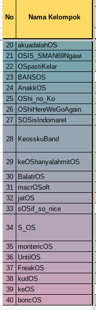
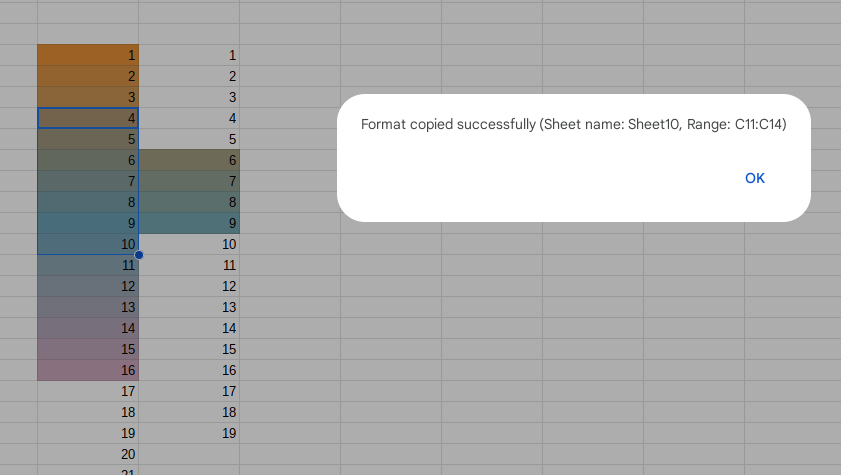
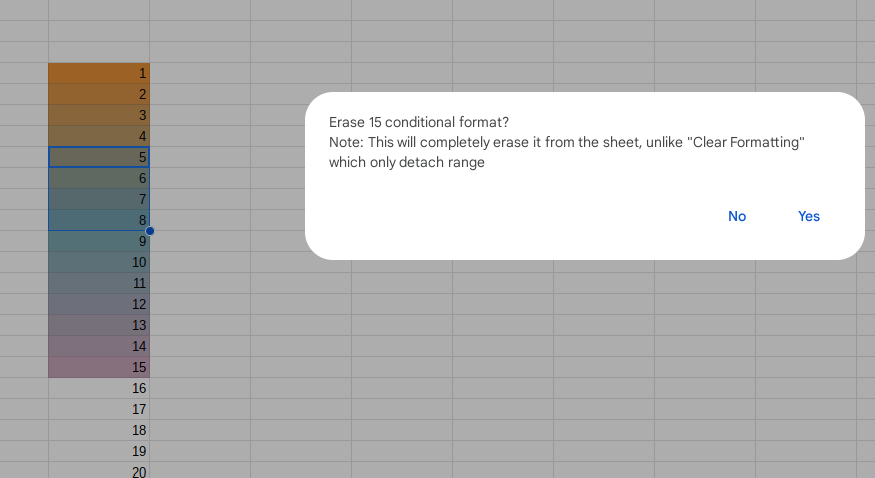

# Brush's Bargain Bin Script

Set of personal Google Sheets apps script.

Features
- Automatic conditional formatter for categorical values

- Copy all conditional format in selected range to other sheet (within 1 workbook)

- Erase all conditional format in selected range (completely erase it from current active sheet, not just detach like "Clear formatting")

